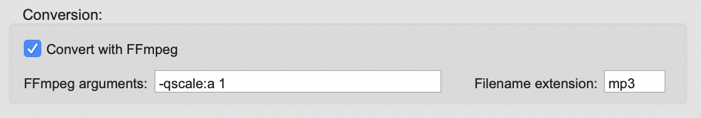

# Multi-region Exporter – for Cubase

## What and why?

This tool is made to make the process of exporting multiple audio regions in a Cubase project easier.

If you are exporting a lot of regions (songs, sounds etc.) from the same Cubase project, it can be very cumbersome and time consuming to export them all individually. For every region, you have to select it, open the export menu and give the exported file an appropriate name. Especially if you have to do it more than once - if, for example, you want to change something in the mix - it can be very annoying.

The Multi-region Exporter's aim is to make this process less annoying, making it easier to iterate and refine along the way.

**Note**, however, that if you own Cubase Pro 9 or later, you will have the built in possibility of doing audio mixdown based on cycle markers (see for example [here](https://www.youtube.com/watch?v=Bm0S7NWWBBE)) thus making this tool a bit less relevant.  
For earlier versions, this tool is still relevant. Furthermore, this tool allows you to export regions based on audio events/parts (without cycle markers), making wave editing more simple in Cubase. And from version 2.0 you can also base the export on parts in midi tracks or instrument tracks.

The principle is very simple: you export the whole project to one audio file and then use this tool to split it into the appropriate and named files on the basis of a Cubase track file.

The splitting/extracting is done by the [SoX](http://sox.sourceforge.net/) command line tool which is lossless with uncompressed formats. A big thanks to SoX for sharing their tool openly and freely.

The generation of audio waveform and the optional conversion to mp3 is done by [FFMPEG](https://www.ffmpeg.org/) which in turn uses the [LAME](http://lame.sourceforge.net/) mp3 encoder for mp3 conversion. Also a big thanks to FFMPEG and LAME for sharing their tools.

I created the tool because I needed it myself for a project where I was working with a lot of foley sounds for a computer game. It is very annoying to export about 30 footstep sounds (including naming them), do some changes and then export them again.  
And why not share the tool so that others might benefit from it as well? I think that it makes Cubase a better tool for this kind of projects.

It must be mentioned that the program has been developed and tested with Cubase 8. Therefore I can not guarantee that it will work with all other Cubase versions. Let me know if you experience that the program can't properly read and interpret the track files from your Cubase version.

It must also be mentioned that Cubase and Steinberg have nothing to do with the development of this tool and therefore they are in no way responsible for it - its functionality / lack of functionality or for supporting it.

## Installation

**On Windows:**

- Unzip and run the installer file.

- Note that when running the msi installer, Windows will probably say:

_Windows protected your PC_  
_Microsoft Defender SmartScreen prevented an unrecognised app from starting. Running this app might put your PC at risk._

To install anyway, just click _More info_ and then _Run anyway._

You can uninstall again just like uninstalling any other application on Windows.

**On OS X:**

- To install, first mount the DMG file, and drag the app into applications.

Now, because I am not a registered Apple developer, the app is not signed and 'notarized'. That means that mac OS X will say that the app is damaged when trying to open it. This is because mac OS X has put the downloaded app into quarantine using the so-called extended attribute com.apple.quarantine. So in order to allow it to run anyway, we need to remove that attribute using mac's Terminal (I'm sorry) as follows:

- Open the mac Terminal (you can just search for it with Spotlight).

- Type / paste the following command where <path to app> should be replaced by the path to the app (you can just drag the app onto the terminal and it will paste in the path) and commit by pressing enter:

    >sudo xattr -r -d com.apple.quarantine <path to app>

- It will now ask for your password (the one normally used for installing stuff) so just type that in followed by enter. Now you can close Terminal again.

- The first time you open the app, do it by right-clicking on it and choosing 'Open' and then choose 'Open' again in the following pop-up menu (again saying that the app is damaged).

- That's it! After this first time opening, you should be able to open it normally.

To uninstall, just delete the app again from 'applications' folder.

## User manual

### The short version

The Multi-region Exporter - for Cubase (henceforth called the Exporter) works like this:

1. First, in Cubase, you export a full audio mix-down from time 0:00 containing all desired audio regions. You also export a track file (XML) containing information about the different desired audio regions (start, end, name/description) - this could be from cycle markers on a marker track, audio parts/event on audio tracks and parts on a midi- or instrument track.

3. Then you open the Exporter and load the exported audio file and track file. The Exporter can now extract the regions from the audio file and save them to a location of your choice. It can even name the individual files according to names/descriptions you have given the objects in Cubase.

That's it!

Below is a more in-depth description of how to use the Exporter.

### The slightly longer version

The usage of this tool falls in two parts: what is done in Cubase and what is done in the Exporter.  
These two parts are described in greater detail below.

#### In Cubase

**What we want to do in Cubase** is to export an audio mix-down of the whole project as well as a track file containing info about the different desired audio regions (start, end, name/description).

**Exporting an audio mix-down** should be straightforward. The only important thing to note here is that you have to export from the beginning of the project. So even if the first audio doesn't start until 2 minutes in, you have to export from time 0:00. Otherwise, the Exporter will not extract the desired regions at their correct positions in time.

<figure>

<figcaption>

The audio mix-down shown on the left will not work with this tool since it is not exported from the start of the project. The one on the right is, well, right :-) The length of the mix-down doesn’t matter as long as it contains all desired regions.

</figcaption>

</figure>

**Regarding audio format**, you should generally export to the format you wish to end up with (if uncompressed). The Exporter program can read most uncompressed formats and will extract unmodified bites of audio from the full mix-down file. It uses [SoX](http://sox.sourceforge.net/) for this extraction, which is lossless where possible.  
As of version 2.0 **the exporter can now also convert the extracted bites into many other formats**. It uses [FFmpeg](https://www.ffmpeg.org/) to do this, and you can specify the output filename extension as well as arguments/options given to FFmpeg. So, for example, if you want to end up with mp3 files, just export to some uncompressed format (wav, aiff ...) and then do FFmpeg conversion when extracting the regions in The Exporter program.

Now we want to **export a Track file from Cubase** that contains information about the position and length of each desired region as well as potentially the region’s name. The track file can be based on marker tracks with cycle markers, audio tracks with audio events/parts and midi- and instrument tracks with midi parts. It can also contain many different tracks.  
If you have an audio track where each audio event corresponds to a desired output region, it is fast and easy to export that track. However, a marker track with cycle markers is more versatile since each marker can span multiple audio events of different length and position.  
If you give each event on the track to be exported an appropriate name, this name can be used by the Exporter program for naming the extracted files. You name the individual events in the info line in the field **_Description_ for audio events and markers,** **_Name_ for audio parts** (where two or more audio events are 'glued' together) and also **_Name_ for parts in midi- and instrument tracks**.  
You export the track(s) by selecting it/them in the project window, then go to File -> Export -> Selected Tracks… If exporting an audio track, make sure to select reference when asked about what to do with the media files – there is no reason to copy them. The resulting track file is an XML file with info about the track(s).

<figure>

<figcaption>

Exporting a track file in Cubase. Here it is done on the basis of a marker track.

</figcaption>

</figure>

<figure>

<figcaption>

Choose 'reference' in the pop-up menu (only appears if the export track(s) contains media files). There is no need to copy media files.

</figcaption>

</figure>

**Note** that you can export multiple tracks in the track file, and that the desired regions can be overlapping if you like.

**Tip:** If you work with cycle markers I recommend assigning a key command for inserting these. This makes it easy and fast to do. Furthermore, if you really have a lot of regions with similar names, you can handle the naming of events by using the logical editor in Cubase.

**Tip:** You don't have to use cycle markers. You can base the track file on the events/parts of one or more audio tracks or/and parts from midi- and instrument tracks. This can be time saving for example if you use Cubase for wave editing.

#### In the Multi-region Exporter

**What we want to do in the Exporter** is to extract the individual desired regions from the full audio mix-down.

First we **load the audio mix-down** we exported from Cubase.

<figure>

<figcaption>

You load an audio file (audio mix-down from Cubase) by pressing this button and choosing the file.

</figcaption>

</figure>

Then we **load the Cubase track file** that we also exported from Cubase – it has the file ending .xml. This file contains information about the regions we want to extract from the full-length audio file.

<figure>

<figcaption>

Load the track file by pressing this button.

</figcaption>

</figure>

Now we should see something like this in the Exporter’s waveform preview area:

<figure>

<figcaption>

The Exporter shows a waveform preview of the loaded audio file as well as a preview of the regions found in the loaded track file.

</figcaption>

</figure>

Now we are ready to let the Exporter **extract the regions and output them to a specified location**.

<figure>

<figcaption>

Extract the regions by pressing this button and specifying a location for the output files.

</figcaption>

</figure>

That is basically it! Now the Exporter will have extracted the individual regions from the full audio file and placed the audio files in the folder you specified.

However, there are a couple of very useful **settings in the options area** that I will quickly explain.

In the **file naming** settings you can specify whether the extracted files should be named by the names (Description/Name) you have given the corresponding elements in Cubase or whether they should have a fixed name followed by \_0001, 0002 etc.

<figure>

<figcaption>

File naming settings

</figcaption>

</figure>

In the **trailing time** settings you can specify an optional amount of milliseconds to be added to the length of each region. If you have a reverb or delay effect in your mix in Cubase, you would probably want to allow this effect to ring off instead of just cutting abruptly as the ‘content’ of the tracks stops. In such a case it can be useful to add some trailing time. If you use a marker track for exporting the track file, you can of course also just adjust the length of each cycle marker in Cubase.

<figure>

<figcaption>

Trailing time settings

</figcaption>

</figure>

In the **conversion** settings you can choose if the files should be converted into another file format using [FFmpeg](https://www.ffmpeg.org/).

You can specify the FFmpeg arguments/options as well as the filename extension (for the output files). The arguments are everything you would normally put between the input file and the output file in a normal FFmpeg command. If you are a bit rusty on FFmpeg, just google something like “ffmpeg convert to <some format> options” or check out the [FFmpeg documentation](https://ffmpeg.org/ffmpeg-all.html). And if you just leave the 'FFmpeg arguments' field empty and type in the filename extension, you will normally just get a conversion with default settings.

### Presentation videos

I have become aware of a couple of videos made by others presenting the functionality of this tool.  
The first one is made by Ulf Blomberg who runs the recording studio [HoboRec](http://www.hoborec.com/) in Jönköping, Sweden.  
The second one is in Czech and it’s made by Thomáš Nykl who runs the [oToman Studio](http://www.otomanstudio.cz/) in Prague.  
Thanks a lot to Ulf and Thomáš for these videos.

https://youtu.be/YBD-OeY1akE

https://youtu.be/qPq7PfU\_Lx0

## FAQ and troubleshooting

- **My mac says that the 'app is damaged' and should be moved to the trash. What is that all about?**
    - The app is not damaged but merely put in 'quarantine' by the operating system. See the Installation section (earlier in the documentation) for instructions on how to fix this.

- **I can't install the program on Windows and it says that 'Microsoft Defender SmartScreen prevented an unrecognised app from starting'.**
    - See the Installation section (earlier in the documentation)

## Known issues

- In versions before 2.0, The Exporter would not find the right regions in time if an other tempo than the default 120 was used (for tracks not set to linear mode). This serious bug/shortcoming should be fixed as of version 2.0.

- In versions before 1.0.0.3, if you base the splitting on an audio track where some audio events are merged into parts, sometimes (for some strange reason) one (or more?) of the contained events also appear as separate audio events with the offset it has within the part. This must be due to some bug in Cubase's track exporter. If this happens, just delete this extra extracted audio bite after export. Anyway, the exporter disregards audio events that are placed within parts, so only the surrounding part is used for extraction. This should be fixed from version 1.0.0.3.

- If you use the track delay functionality on a track in Cubase, be aware that the events/parts on this track will 'sound' at a different time than their actual position on the timeline. Therefore such a track might not be the best to export your track (XML) file from.

- Let me know, if you find any other issue/bug

## License, attributions and acknowledgements

The Multi-region Exporter - for Cubase consists partly of other software (SoX, FFmpeg, OpenJDK) distributed along with it.  
Each of these have their own license agreement.

The part that is made specifically for The Multi-region Exporter (not SoX, FFmpeg or OpenJDK) is open source and licensed under the [GNU General Public License (GPL) version 3](http://www.gnu.org/licenses/gpl-3.0.html) which basically means that:

> This program is free software: you can redistribute it and/or modify it under the terms of the GNU General Public License as published by the Free Software Foundation, either version 3 of the License, or (at your option) any later version.
> 
> This program is distributed in the hope that it will be useful, but WITHOUT ANY WARRANTY; without even the implied warranty of MERCHANTABILITY or FITNESS FOR A PARTICULAR PURPOSE.  See the GNU General Public License for more details.

The audio splitting is done by [SoX - Sound eXchange](http://sox.sourceforge.net/) which is distributed in binary form with The Multi-region Exporter – for Cubase. SoX itself is licensed under the [GNU General Public License version 2](http://www.gnu.org/licenses/gpl-2.0.html). The source code for SoX can be found on the SoX project's homepage. Below I have included the license notification from the SoX documentation:

> Copyright 1998−2013 Chris Bagwell and SoX Contributors.  
> Copyright 1991 Lance Norskog and Sundry Contributors.
> 
> This program is free software; you can redistribute it and/or modify it under the terms of the GNU General Public License as published by the Free Software Foundation; either version 2, or (at your option) any later version.
> 
> This program is distributed in the hope that it will be useful, but WITHOUT ANY WARRANTY; without even the implied warranty of MERCHANTABILITY or FITNESS FOR A PARTICULAR PURPOSE. See the GNU General Public License for more details.

Thanks to SoX for making and sharing this tool.

The generation of audio waveform and the optional conversion to other formats is done by [FFMPEG](https://www.ffmpeg.org/) which is distributed with the program in binary form. FFMPEG is itself licensed under the [GNU Lesser General Public License (LGPL) version 2.1](http://www.gnu.org/licenses/old-licenses/lgpl-2.1.html) or later (read more here: [https://www.ffmpeg.org/legal.html](https://www.ffmpeg.org/legal.html)).

A big thanks to FFMPEG for creating and sharing their tool.

The distributed OS X binary of FFMPEG is the one available here: [https://evermeet.cx/ffmpeg/](https://evermeet.cx/ffmpeg/)  
You can read more about the included libraries, find source code and their respective licenses on the web site.

The distributed Windows binary of FFMPEG is the one available here: [http://ffmpeg.zeranoe.com/builds/](http://ffmpeg.zeranoe.com/builds/)  
You can read more about the included libraries, find source code and their respective licenses on the web site.

The Multi-region Exporter is also distributed with its 'own' copy of the Java Runtime Environment (JRE). This is because the Exporter runs on Java - the JRE is included to ensure that the Exporter has access to a compatible JRE version. While this does make the application around 9 times as big as if relying on a public JRE on the user's computer, I think it is worth the extra megabytes. The included JRE is from OpenJDK and it has its own licence agreement, which can be found here: [https://openjdk.java.net/legal/](https://openjdk.java.net/legal/)

Thanks to [MegaNørd](http://meganørd.dk/) and [G.O.L.D.](https://xn--meganrd-u1a.dk/index.php/2016/04/06/gold/)

Thanks to friends and family for testing and counselling.
